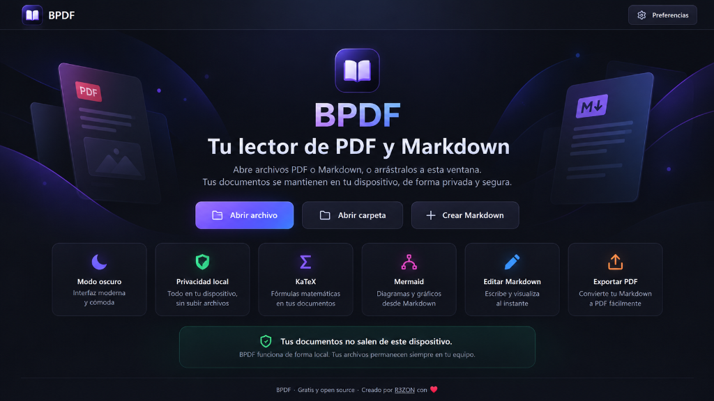

<p align="center">
  
</p>

<h1 align="center">BPDF</h1>

<p align="center">
  <strong>Visor y editor open source de PDF y Markdown, pensado para leer en modo oscuro.</strong>
</p>

<p align="center">
  Creado por <a href="https://r3zon.com"><strong>R3ZON</strong></a> con ❤️
</p>

<p align="center">
  <a href="https://bpdf.r3zon.com">
    
  </a>
  <a href="LICENSE">
    
  </a>
  <a href="https://github.com/alexhiguera/BPDF/actions/workflows/ci.yml">
    
  </a>
  <a href="https://github.com/alexhiguera/BPDF/actions/workflows/e2e.yml">
    
  </a>
  <a href="https://bpdf.r3zon.com">
    
  </a>
  <a href="https://docs.r3zon.com/bpdf">
    
  </a>
</p>

<p align="center">
  <a href="https://bpdf.r3zon.com">
    
  </a>
</p>

---

**BPDF** es una aplicación web para abrir, leer y editar archivos **PDF** y **Markdown** directamente en el navegador.

🌐 **Úsalo sin instalar nada:** [bpdf.r3zon.com](https://bpdf.r3zon.com)

📚 **Documentación:** [docs.r3zon.com/bpdf](https://docs.r3zon.com/bpdf)

🔒 **Tus documentos no salen de tu dispositivo.** BPDF no tiene backend, cuentas, base de datos, telemetría ni subida de archivos.

## ✨ Características

### 📄 PDF

BPDF utiliza un visor propio construido sobre **pdf.js**.

- 🌙 **Modo oscuro selectivo:** oscurece el fondo y aclara el texto sin invertir las fotografías.
- 🔎 Búsqueda de texto.
- 🖼️ Miniaturas de páginas.
- 🔍 Zoom.
- 🔄 Giro de página.
- 📖 Vista continua o página a página.
- 🖥️ Pantalla completa.
- ⌨️ Atajos de teclado.
- 🔐 Apertura de PDF protegidos mediante contraseña.
- 📝 Formularios visibles, aunque no editables en v1.
- 🎨 Conservación de fotografías, imágenes y gráficos en sus colores originales.

La contraseña de un PDF se utiliza únicamente para abrir el documento y **BPDF no la guarda**.

### 📝 Markdown

Lector Markdown compatible con **GFM**:

- tablas;
- listas de tareas;
- notas al pie;
- índice automático;
- bloques de código con resaltado;
- enlaces;
- imágenes locales;
- fórmulas **KaTeX**;
- diagramas **Mermaid**.

El HTML incluido en un Markdown **no se interpreta como HTML ejecutable**.

### 🖼️ Recursos locales

Las imágenes de un Markdown se pueden mostrar si:

- seleccionas el `.md` junto con sus imágenes;
- abres la carpeta que contiene el documento;
- o arrastras los recursos correspondientes.

BPDF solo puede acceder a los archivos que hayas seleccionado explícitamente.

Las imágenes remotas **no se descargan automáticamente**.

### ✍️ Editor Markdown

BPDF incluye un editor basado en **CodeMirror 6**.

- edición de Markdown;
- historial deshacer/rehacer;
- **modo Lectura**;
- **modo Edición**;
- **modo Dividido**;
- vista previa sincronizada;
- KaTeX y Mermaid en la vista previa;
- guardado local;
- **Crear Markdown**: un documento nuevo, vacío, que se abre en modo Dividido;
- **Guardar como…**: el Markdown en otro destino (`.md`) o **exportado a PDF**.

En Chrome y Edge puede utilizar el diálogo nativo para guardar archivos. En Firefox y Safari utiliza una descarga local como alternativa.

### 🖨️ Exportar a PDF

Cualquier Markdown (abierto, nuevo o editado, en cualquier modo) se puede guardar como PDF con **Guardar como… → PDF**, en tema **claro** u **oscuro**.

- se usa la impresión del navegador («Guardar como PDF»): sin librerías de PDF ni servidores;
- el texto sigue siendo seleccionable y las fórmulas y los diagramas, vectoriales;
- el PDF lleva solo el documento: sin cabeceras, pies ni marca de BPDF;
- el tamaño de papel se elige en el diálogo del navegador;
- la elección de colores no se guarda.

### ⚙️ Preferencias

BPDF puede recordar en tu navegador:

- zoom predeterminado de PDF;
- modo de visualización;
- miniaturas;
- atajos de una tecla;
- tamaño de letra de Markdown;
- ancho del contenido;
- página y zoom por los que ibas en cada PDF.

Puedes borrar las posiciones guardadas o restablecer todas las preferencias desde la propia aplicación.

---

## 🔒 Privacidad

BPDF está diseñado como una aplicación **local-first**.

Tus documentos se procesan en tu navegador.

BPDF no tiene:

- ❌ backend;
- ❌ base de datos;
- ❌ cuentas de usuario;
- ❌ sincronización en la nube;
- ❌ telemetría;
- ❌ analytics;
- ❌ subida de documentos.

Un documento tampoco puede hacer que BPDF cargue automáticamente imágenes, fuentes, scripts u otros recursos desde Internet.

La aplicación utiliza una **Content Security Policy estricta** para reforzar estas restricciones.

### Datos guardados en el navegador

BPDF únicamente utiliza dos entradas de almacenamiento local:

| Clave | Contenido |
| --- | --- |
| `bpdf:prefs` | Preferencias de la aplicación |
| `bpdf:positions` | Posición y zoom de documentos PDF mediante una huella |

No se almacena:

- el nombre del archivo;
- el contenido del documento;
- contraseñas;
- búsquedas;
- estado del editor.

Más información:

- [Seguridad interna](docs/SEGURIDAD.md)
- [Privacidad y datos locales](public_docs/referencia/privacidad-y-datos-locales.md)
- [SECURITY.md](SECURITY.md)

---

## 🌐 Navegadores compatibles

BPDF requiere JavaScript y está pensado para versiones modernas de:

| Navegador | Versión mínima |
| --- | ---: |
| Chrome / Edge | 111+ |
| Firefox | 128+ |
| Safari | 16.4+ |

Las pruebas automatizadas se ejecutan en:

- Chromium;
- Firefox;
- WebKit.

BPDF funciona tanto en ordenador como en dispositivos móviles, con una interfaz adaptable.

---

## ⚠️ Limitaciones conocidas de v1

BPDF prioriza simplicidad, privacidad y una superficie de ataque pequeña.

Actualmente:

- solo se abre **un documento a la vez**;
- no incluye OCR;
- los formularios PDF se muestran pero no se rellenan;
- solo existe tema oscuro;
- documentos Markdown muy grandes pueden tardar varios segundos en procesarse;
- documentos muy grandes con muchas fórmulas pueden reducir el rendimiento del modo Dividido;
- no existe sincronización entre dispositivos.

Consulta la lista completa en [Límites conocidos](public_docs/referencia/limites-conocidos.md).

---

## 🛠️ Desarrollo

### Requisitos

- **Node.js 24**
- npm
- Git

La versión de Node está fijada en `.nvmrc`.

Con `nvm`:

```bash
nvm use
```

En Windows recomendamos trabajar dentro de **WSL**.

### Instalar

```bash
git clone https://github.com/alexhiguera/BPDF.git
cd BPDF
npm ci
```

### Desarrollo

```bash
npm run dev
```

La aplicación estará disponible en:

```text
http://localhost:5173
```

> El servidor de desarrollo no reproduce todas las cabeceras de seguridad de producción. Consulta [`docs/DEVELOPMENT.md`](docs/DEVELOPMENT.md).

### Build de producción

```bash
npm run build
```

La aplicación estática se genera en:

```text
dist/
```

Puedes servirla localmente con las cabeceras equivalentes a producción:

```bash
npm run preview
```

BPDF no necesita servidor de aplicación ni variables de entorno.

La web oficial se distribuye mediante **Vercel**, pero `dist/` puede alojarse en cualquier hosting de archivos estáticos que permita configurar las cabeceras necesarias.

La configuración de seguridad tiene como fuente:

[`src/config/security-headers.ts`](src/config/security-headers.ts)

---

## 🧪 Tests

### Comprobaciones principales

```bash
npm run lint
npm run typecheck
npm run test:run
npm run build
```

### E2E

Chromium:

```bash
npm run test:e2e
```

Firefox y WebKit:

```bash
npm run test:e2e:compat
```

La primera vez instala los navegadores de Playwright:

```bash
npx playwright install --with-deps
```

### Build

```bash
npm run build
npm run build:tamano
npm run build:verificar
```

### Documentación

```bash
npm run docs:validar
npm run docs:enlaces
```

### Todo junto

```bash
npm run lint &&
npm run typecheck &&
npm run test:run &&
npm run build &&
npm run build:tamano &&
npm run build:verificar &&
npm run docs:validar &&
npm run docs:enlaces
```

---

## 🏗️ Arquitectura

BPDF intenta mantener una arquitectura deliberadamente pequeña:

```text
Archivo local
     │
     ▼
Validación
     │
     ├── PDF ──────► pdf.js ──────► visor + modo oscuro
     │
     └── Markdown ─► parser ───────► lectura / editor / preview
                                      │
                                      ├── KaTeX
                                      └── Mermaid aislado
```

No hay una API o backend entre el documento y el navegador.

Documentación técnica:

- [Arquitectura](docs/ARCHITECTURE.md)
- [Desarrollo](docs/DEVELOPMENT.md)
- [Seguridad](docs/SEGURIDAD.md)
- [Stack](docs/STACK.md)
- [Índice de documentación interna](docs/README.md)

---

## 📚 Documentación

La documentación pública tiene como fuente:

[`public_docs/`](public_docs/)

Se publica en:

🌐 **[docs.r3zon.com/bpdf](https://docs.r3zon.com/bpdf)**

y en la **[GitHub Wiki](https://github.com/alexhiguera/BPDF/wiki)**. Las dos salen de la
misma fuente; la Wiki no se edita a mano:

```bash
npm run wiki:generar -- ../BPDF.wiki
```

---

## 🤝 Contribuir

Las contribuciones son bienvenidas.

Antes de abrir una PR:

1. lee [`CONTRIBUTING.md`](CONTRIBUTING.md);
2. revisa el [`CODE_OF_CONDUCT.md`](CODE_OF_CONDUCT.md);
3. añade tests cuando el cambio los necesite;
4. ejecuta las comprobaciones relevantes.

Para errores utiliza los Issues de GitHub.

Para vulnerabilidades de seguridad, **no abras un issue público**. Consulta [`SECURITY.md`](SECURITY.md).

---

## 🛡️ Seguridad

Si encuentras una vulnerabilidad, utiliza el sistema privado de reporte de vulnerabilidades de GitHub.

Consulta:

**[SECURITY.md](SECURITY.md)**

---

## 🗺️ Roadmap

La versión **1.0.0** establece la primera versión pública estable de BPDF.

Las posibles mejoras futuras se mantienen separadas del alcance de v1. Entre ellas pueden evaluarse:

- mejoras de compatibilidad;
- nuevas versiones de Mermaid;
- mejoras de búsqueda del editor;
- nuevas opciones visuales;
- optimizaciones para documentos excepcionalmente grandes.

---

## 📄 Licencia

BPDF se distribuye bajo la licencia **Apache License 2.0**.

Consulta [`LICENSE`](LICENSE) y [`NOTICE`](NOTICE).

**Copyright © 2026 R3ZON CONSULTING SL**

Las dependencias y recursos incluidos en la aplicación —como pdf.js, KaTeX, Mermaid y sus fuentes— conservan sus respectivas licencias.

---

<p align="center">
  <strong>BPDF</strong><br>
  Gratis · Open source · Local-first
</p>

<p align="center">
  Creado por <a href="https://r3zon.com"><strong>R3ZON</strong></a> con ❤️
</p>
