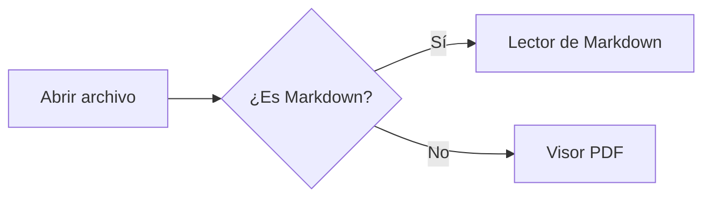
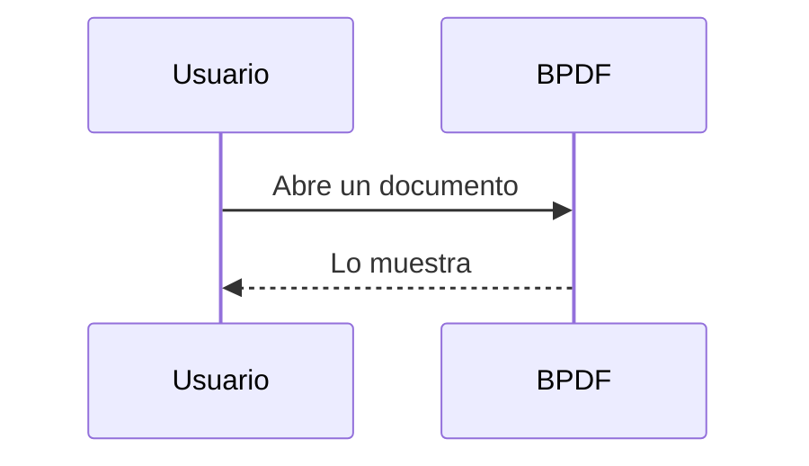
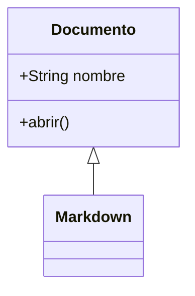
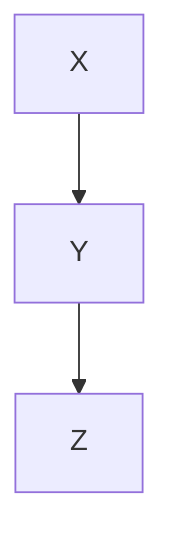

# Diagramas

## Diagrama de flujo

```mermaid
flowchart LR
  A[Abrir archivo] --> B{¿Es Markdown?}
  B -- Sí --> C[Lector de Markdown]
  B -- No --> D[Visor PDF]
```

## Secuencia

```mermaid
sequenceDiagram
  participant U as Usuario
  participant B as BPDF
  U->>B: Abre un documento
  B-->>U: Lo muestra
```

## Clases

```mermaid
classDiagram
  class Documento {
    +String nombre
    +abrir()
  }
  class Markdown
  Documento <|-- Markdown
```

## Grafo sencillo

```mermaid
graph TD
  X --> Y
  Y --> Z
```

## Diagrama no válido

```mermaid
flowchart LR
  A -->
  esto no es mermaid ((
```
