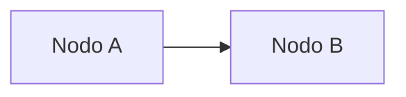
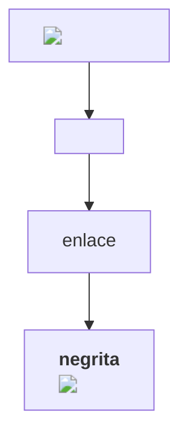
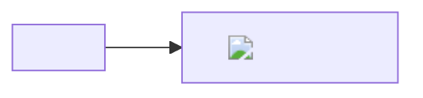
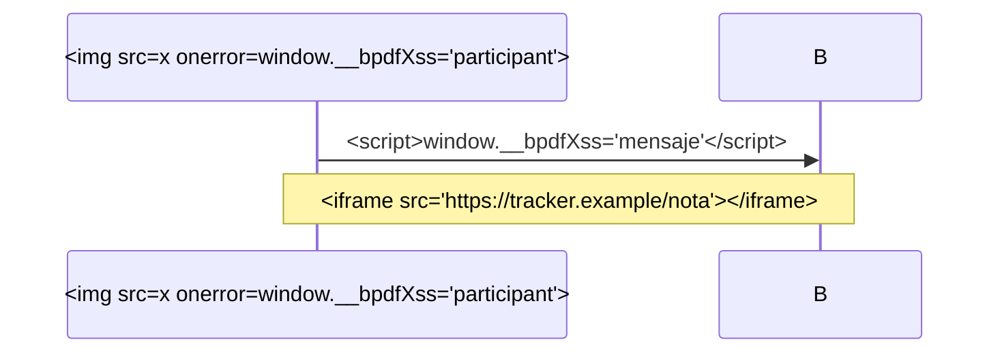
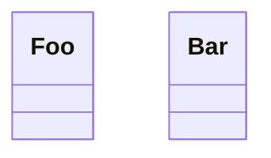

# Mermaid hostil

Cada diagrama intenta ejecutar algo, pedir algo a la red o salirse de su imagen. Si algo
se ejecutara, escribiría en `window.__bpdfXss`.

## click



## HTML en las etiquetas



## Directiva que intenta relajar la seguridad



## Imágenes en nodos

```mermaid
flowchart LR
  A@{ img: "https://tracker.example/nodo.png", label: "remota", pos: "t", w: 60, h: 60 }
  B@{ img: "data:image/svg+xml;base64,PHN2ZyBvbmxvYWQ9ImFsZXJ0KDEpIi8+", label: "data", pos: "t", w: 60, h: 60 }
  A --> B
```

## Secuencia con HTML



## Clases con enlaces



## IDs que pisarían globales

```mermaid
flowchart LR
  location --> __proto__
  constructor --> body
  document --> window
```
